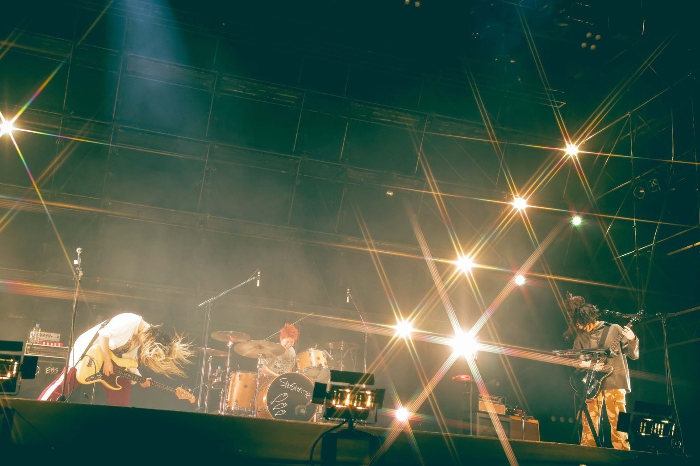

第一站当然是直奔tower records，在PARCO的六层。门口在宣传这两天的music fes。

好多人，好多老人。买到了在东京没买到的碟。

坐了一个小时的昭和バス来到了二見ヶ浦，一路上在听opus和aqua。

大风大雨，鞋湿+进沙子，但还是愿意在这里待很久。

喜欢最后一张照片。

室内音乐节，分左右舞台，不幸被分在了右舞台...

fes前复习了SHISHAMO的歌，第一次接触这个乐队是gakki的电影的片头和片尾曲。感觉无论什么样的曲子似乎都能表面上唱得很欢快。

想到了这样的句式：是什么...？是可爱。

演出间隙此起彼伏的"朝子さん"让我第一次知道了主唱的名字(虽然被她"よう喋るな"开玩笑怼了回去)。她的声音和吉他让我有种违和的恍惚感，赞美意义的。

其他的乐队和歌手似乎只有我不太熟悉，甚至无法从演出表上辨别出乐队/歌手名。只能滥竽充数，假装知道节奏跟着旁边的观众一起挥动着手。

回想起来，为什么在那样的环境下我会"逼迫"自己做出和周围的人相同的事情呢？其他场合也是一样，比如擦肩而过时条件反射般的弯腰点头示意。出于礼貌吗？我觉得自己不算是个有礼貌的人。不想被其他人发现自己不属于这里？可能有一些。还有其他。思来想去，归因为过于看重别人的目光。这是人类在新环境中的局限性吗，还是自己的呢？仅仅是为了获得短暂的归属感多此一举，调整自己的行为和认知或许有些正面意义。扯远了。

喜欢blue encount和the oral cigarettes这两个乐队的表演，以及SKI-HI，一位看起来很年轻的唱跳实力俱佳的rapper，虽然为他站起来的观众寥寥无几。我也坐着——旁边的人没有站，我也站累了...

实在对不起the oral cigarettes，演出时我一直时不时瞄一眼手机看剩余的时间。

看到五颜六色的电视机出现在左舞台的时候，我知道她来了，她带着她的家电上台了。看到推上有人说リハ的时候听到了『サターン』，没错你的耳朵很厉害，不过你还漏听了一首『綺羅キラー』。虽然只有第一个音，但リハ期间演奏サターン还是太奢侈了。

正经科普：图一乐器叫electric fan harp，图二是TV drum。这场没有microwave。

ACAねさん还是如此美丽冻人。当其他乐队在歌曲间隙说这次fuku fes是2024年的第一个演出时，她说且仅说今天吃了什么，且说了一堆。

大屏幕上的ACAね很清晰，我是说腿。她站在舞台很后侧的地方，拍到上半身的镜头都是远景虚化，除此之外的镜头几乎都是下半身了==

ACAねさん一共唱了八首，大多是音乐节上经常表演的一些，同窓会标准结尾。只是没想到中间唱了acoustic ver的『またね 幻』...听到intro时迟疑了一下，然后眼泪又不争气地流下了。从最开始周围只有我一个人站起来，到全场自发打开了手机的手电筒挥舞，在音乐节这种场合唱抒情歌也太狡猾了。

『またね 幻』是我2022年的top song，BD的现场是acoustic version，更能突出ACAね的情感。括号里的希求我理解为这首歌在ACAね心中真正的意义，对于Ham，サターン也是一样。

歌曲的标题不会写得过于直白，"夹带私货"是一种只属于歌手和想要传达的人之间的浪漫（当然想要传达的人可能就是自己）。比如Ham的解释在MV里的解释是He and me，Dear Mr. F的F解释为Frankenstein。再比如埼玉演唱会上的第一首歌『ばかじゃないのに』，ACAね唯一一次唱到泣不成声。后来她在推特上的解释是想到从出道走到现在一路十分不易。我不确定，说到底听众只是听众，歌曲是属于歌手本人的。

ACAねさん对于我来说就是一种幻的存在。

第二天接着在PARCO附近晃悠，终于在ayu的老家发现了ayu。大街上响起Dearest的瞬间，让我有进去购物的冲动。

在人流量最大的地铁口，头发花白的老人们拉起横幅演讲，年轻人匆匆走过没有停留。

短暂的几天，期待再会。
